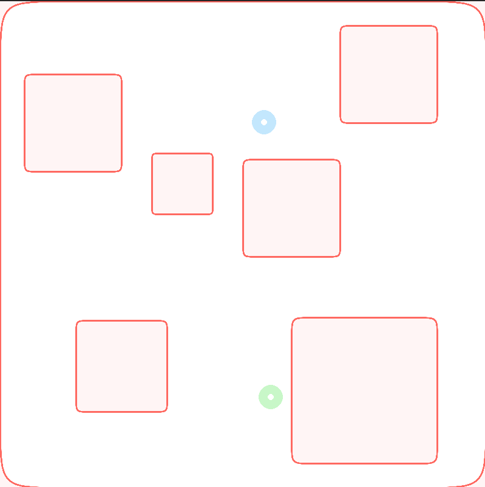

## Environment for Safe Navigation of Ground Robots in Obstacle-Rich Environments

This environment is designed to facilitate the safe navigation of a ground robot within obstacle-rich environments. The primary objective is to develop a composite high-order control barrier function based on the generated map and other constraints such as velocity limitations. This barrier function, accessible through `env.barrier`, is instrumental in ensuring the safety of the robot during navigation. The library allows for the consideration of various robot dynamics, map layouts, and constraints, providing flexibility in experimentation and training scenarios.

### Classes:

1. **Engine:**
   - This class represents the core environment engine responsible for simulating the robot's navigation and interaction with the environment.
   - It initializes the environment, handles actions and observations, computes rewards, and manages the rendering of the environment.
   - Key methods include `reset()` to initialize the environment, `step()` to execute actions and progress the simulation, and `render()` to visualize the environment.
   
2. **Map:**
   - The Map class is responsible for generating the environment map, including obstacles and boundaries.
   - It constructs barriers based on the map layout and constraints, ensuring safe navigation for the robot.
   - The class also manages updates to the map layout and obstacle configurations.

3. **Robot:**
   - This class represents the ground robot within the environment.
   - It encapsulates the robot's dynamics, including state initialization, observation space, and action space.
   - The class allows for the integration of different robot models with customizable configurations.

### Dependencies:
- **numpy**: For numerical computations and array operations.
- **torch**: Used for tensor operations and integration.
- **gymnasium**: Provides the environment interface and utilities.
- **matplotlib**: Enables visualization of the environment and map.
- **pygame**: Used for rendering interactive graphics within the environment.
- **attrdict**: Facilitates the handling of attribute dictionaries.

The environment offers flexibility for experimentation, allowing users to customize robot dynamics, map layouts, and constraints according to their specific scenarios. Additionally, the provided barrier function enhances safety during navigation, contributing to effective training and evaluation of robotic systems in complex environments.
